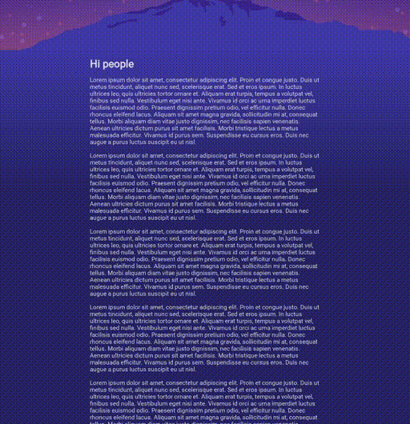

<div align="center">

# capture-my-evolution



**Capture the history of your web project**

</div>

## Installation

1. Make sure you have Node.js installed
1. Make sure you have Google Chrome installed

```bash
npm install -g capture-my-evolution
```


## Getting started

Run the following command inside a Git repository.

```bash
# Will traverse your Git history, run `npm ci && npm run start` and take a screenshot
capture-my-evolution --port <PORT>
```

The output of the screenshots can be found in `screenshots`-folder (per default).
Most probably you want to run a custom command in order to start your website. This tool
does not care what technologies you're using, as long as the website is somehow accessible
over HTTP.

Example using yarn:

```bash
capture-my-evolution -c "yarn && yarn build" -p <PORT>
```

## Options

```
capture-my-evolution --help        
Usage: capture-my-evolution [options]

Options:
  -V, --version                                output the version number
  --path <path>                                The path where the project is located (default: "$PWD")
  -p, --port <port>                            The port of your website
  -h, --host <host>                            The host of your webiste (default: "0.0.0.0")
  --protocol <protocol>                        The protocol your webiste (default: "http")
  -c, --command <command>                      The command to start your website (default: "npm ci && npm run start")
  -t, --tmp <tmp>                              Temporary folder (default: "/tmp/my-history-daecf5bc-1647-4e04-8bf9-05138871d3f2")
  -s, --screenshot <screenshot>                Screenshot directory (default: "$PWD/screenshots")
  --last <last>                                Last amount of commits
  --filter-commit-msg <filter-commit-message>  Filter commit message
  --start-index <start-index>                  Which index it should start with for the image prefix (default: "0")
  --log-level <log-level>                      The log level (default: "info")
  --every-nth <every-nth>                      Only check for every nth commit
  -w, --width <width>                          Width of the screenshot (default: "1440")
  -h, --height <height>                        Height of the screenshot (default: "1080")
  --from <from>                                From which SHA to start
  --help                   
```